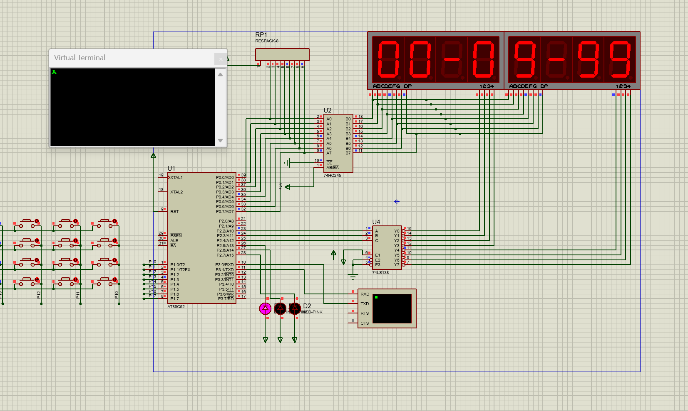
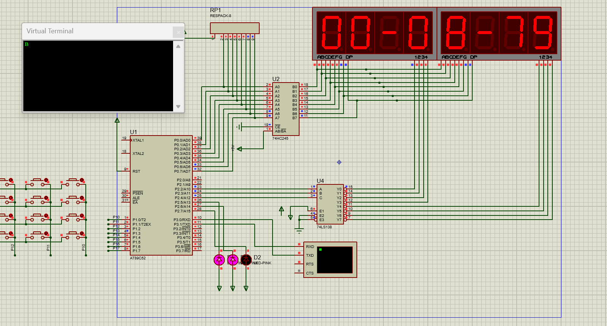

# 流程
1.先把数码管计数搞定
2.再把按键控制搞定
3.再把LED显示搞定
4.最后加上UART

# 仿真

1.数码管计数就是给对应的位置一个对应的数字，而数字是由定时器的数字进入中断的次数count进行对10取模得到
2.按键我选择矩阵键盘的第16个，当它被按下的时候TR0=0保证数码管的数字被保存，然后根据count的得数根据要求就给与多少的灯亮
3.UART则是按照对应的等级去输出对应的等级即可