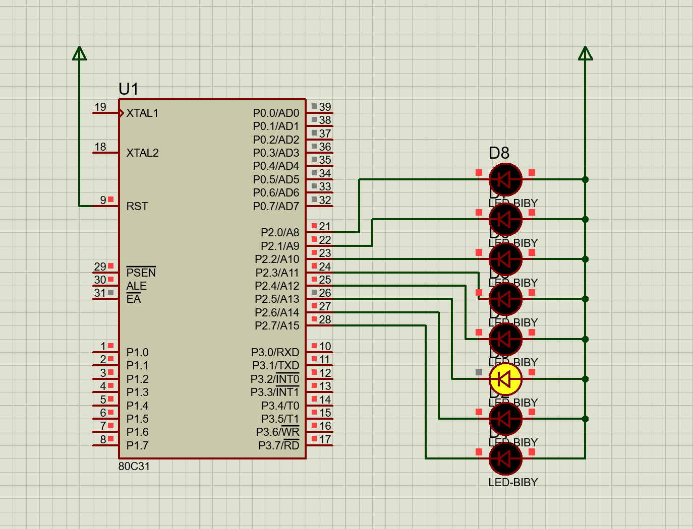

# 图片

1.如图，也是根据手册可得使led亮的原因是外部的电源（形成灌电流，因为拉电流太小了，不太能支撑led的亮）
2.其次，关于阻塞函数89C52RC的晶振是11.0592MHZ的，所以**起振一次**大概是1/11.0592M，**一个机器周期**=12/11.0592M，之后的**内层循环**也需要大约9个机器周期。故完成一次内层循环大概是9.7us，而需要大概1ms的话大概就需要102次，加上一些误差的话就是循环110次设为。
3.图中还应该加上2K的**限流电阻**防止LED烧坏