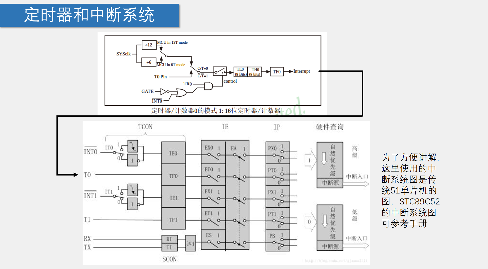

# 定时器

模式1其实就是M1=0&&M0=1，如果能有interrupt产生，首先*下面方框*就需要TF0=0&&ET0=1&&EA=1,PT0就看情况；其次*上面方框*，C/T=0,INT0=1或者GATE=0（有个反向）都可以，然后TR0就一定要=1才可以产生中断。当计数溢出之后TF0=1开始申请中断了。

# 计算
**首先**，需要明白如何在1ms内产生中断。
以11.0592MHZ为例子：如果是选择12T MODE的话，那么TL0寄存器+1需要的时间就是1/（11.0592M/12），而当TL0/TH0寄存器达到65535的时候再+1就会溢出，所以说可以得到式子：start+1m/[1/（11.0592M/12）]=65536
根据式子我们就可以求得start的值，其实就是TL0/TH0这两个八位寄存器的初始值。