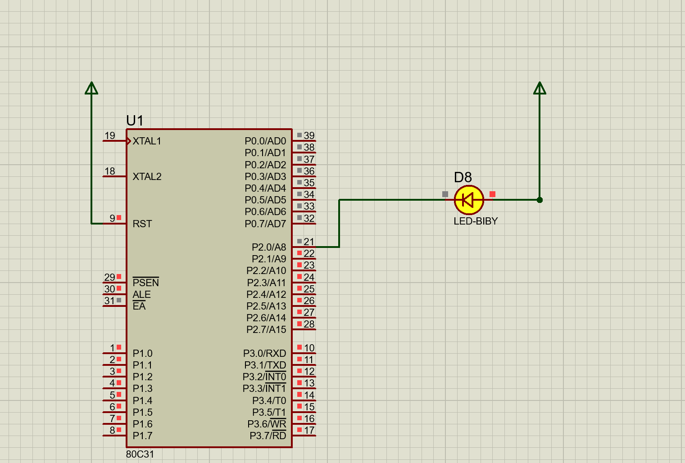
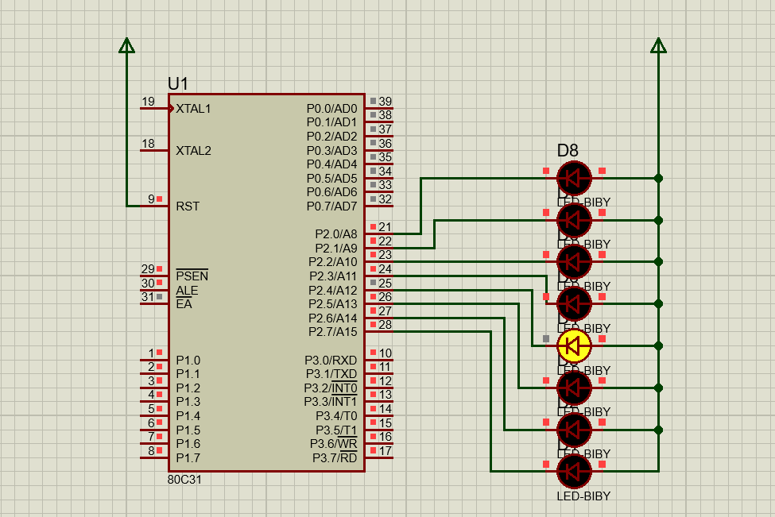
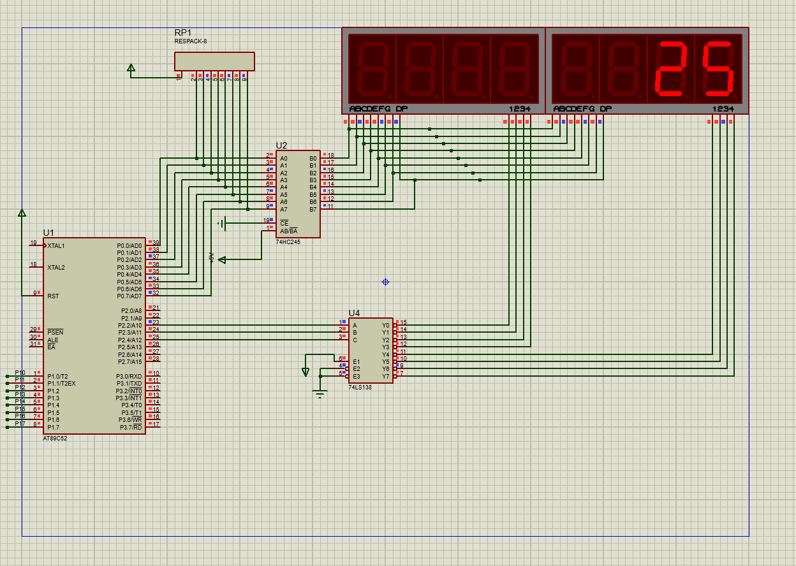

# 2.19

通过定时器**interrupt达到一定次数之后**就进行P2_0口的反转

# 2.20

这个其实就是在上一次的基础上通过对P2寄存器的修改循环（用到"<<"进行移位）

# 2.21

相当于计算interrupt的次数，当达到1000（定时器使1ms溢出一次）数字i+1，数码管的**个位**就是数字（i+1）%10,**十位**就是数字（i+1）/10，然后别忘记消影。