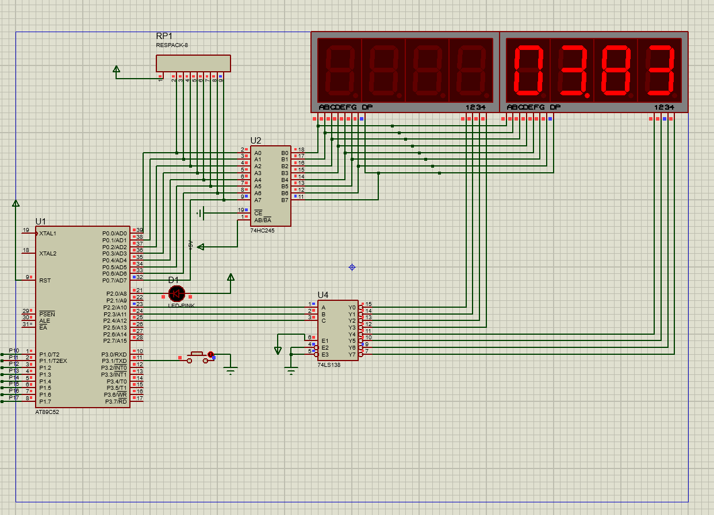
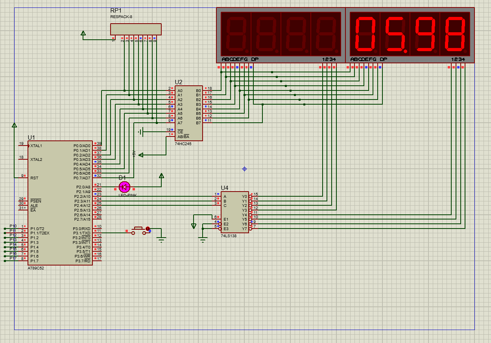
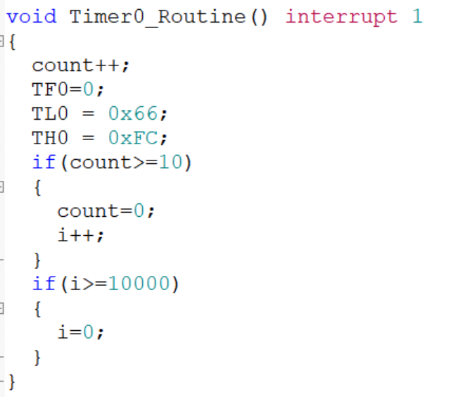

# 2.23要求
按键P3_1控制P2_0（亮表示计时正常，灭表示计时停止）数码管精度的话就精确到0.01s

# 仿真

==第二张图的“8”是因为变化太快导致，也说明计时未停止==

其实就是相较于上个工程将计数的次数i改变了一下：

然后就是对i进行除法再与10取模就可以得到每个数码管上面的数字

1.**第三位上面的小数点就是P0本来要显示的数字|0x80就可以得到**
2.**关于按下按键要定时器停止且寄存器的数值不变，我选择了将TF0进行取反，就可以完成按键和计时的继续与停止的协调**