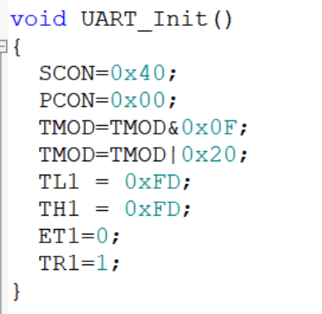
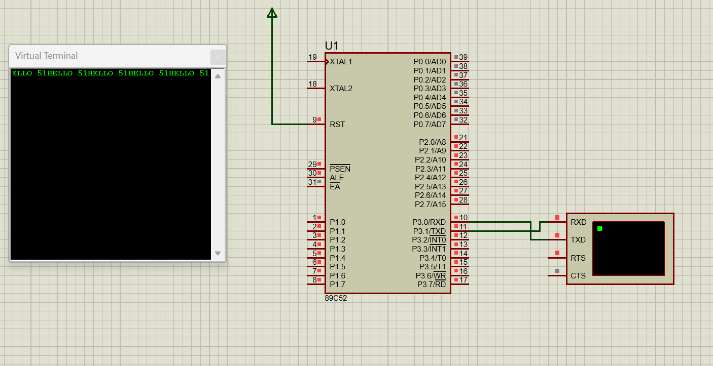
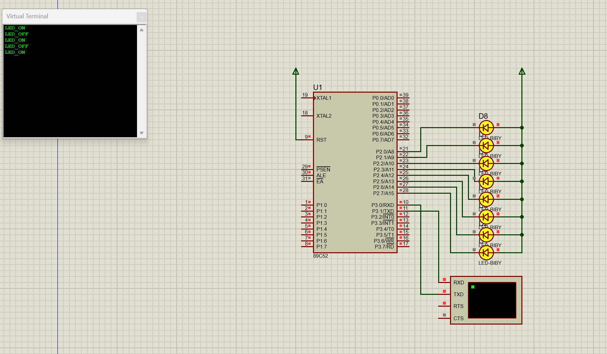

# 2.24
1.*并行与串行*的区别：并行可以多个数据多条线路同时进行，而串行只能一个一个来。所以也可以得出并行的优点是速度快，串行的优点就是抗干扰能力较强。
2.*异步和同步*的区别：最大的区别就是有没有时钟线SCK，有时钟线才可以同步，反之则是异步。
3.*单工/半双工/全双工*的区别：单工是只能一边Transmit，一边Receive；半双工是两边均可T和V,但是不能同时进行；全双工则是两边均可T和V,也可以同时进行。

# 2.25
1.首先明确**波特率的公式**：==2……SMOD/32*T1的溢出率==。波特率是不加倍的，即SMOD=0,如果我们需要设置波特率为9600，则我们可以得出T1的溢出时间=1/（9600*32）
2.晶振是11.0592MHZ，且选择12T模式所以说TL1+1的时间就是12/11.0592*106，那么就可以直接用T1的溢出时间和TL1+1的溢出时间做除法就可以得到一个数字n使得n和TH1/TL1相加就可以得到65535，从而就可以求出TH1/TL1的初始配置的值。

综上我们也可以得出**引起波特率误差**最大的原因其实就是做除法得出来的数字n不是一个整数，就会导致配置时候TL1会产生误差（因为配置寄存器不可能出现小数），那么**解决的方法**就是换一个精度高一点的晶振，例如11.0592MHZ

# 2.26

首先，我们将UART_Init配置好之后，可以将某个字符或者数字赋给SBUF（要求是输出字符串的话就需要用到**数组指针**了，将字符串寄存于一个一个字符，然后再输出出去。

关于发送能够用响应最重要的就是**字符串和字符串的比较**。也是先把需要输出的字符结合一起包成一个字符串，再用**库函数strcmp**比较两者的字符串是否相同，如果是的话就对P2口进行操作。
==注意：==操作完之后数组是不会自己刷新的，所以说又需要用到**库函数memset**去刷新数组。