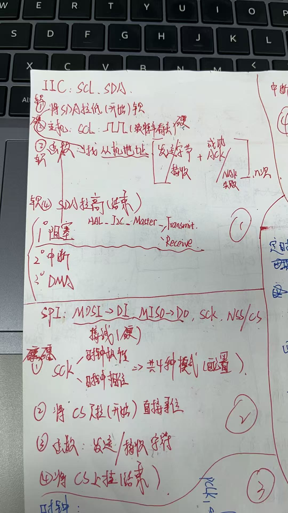
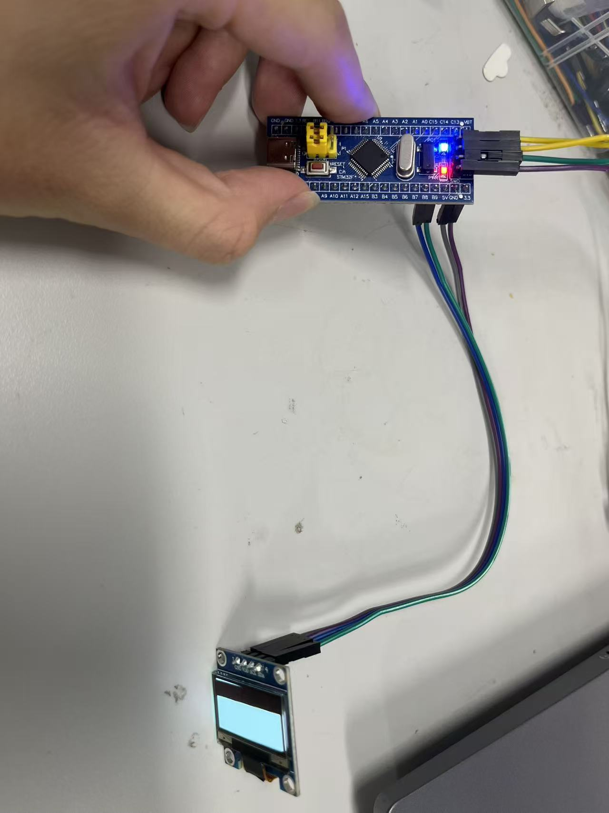

# SPI和I2C的区别

1.最大的区别就是一个**靠地址寻从机**，另外一个可以直接**靠片选CS拉低来寻从机**
2.**I2C是半双工**，工作方式是在SCL高电平的时候将SDA拉低，之后就开始按照从机地址+寄存器地址+写入的数据，然后每个地址写完进去之后需要判断是否为ACK再继续，最后在SCL高电平的时候将SDA拉高结束写入数据（读取也差不多，少了个写入数据）
3.**SPI是全双工**，SPI有四种工作模式，分别是时钟极性两种*时钟相位两种。首先先通过CS的拉低来选择传输的对象，接着通过读取函数或者写入函数来进行芯片之间的交流，最后将CS上拉结束。

# 点亮OLED

1.首先先配置好引脚，接着查数据手册能发现OLED的地址是0x78，向里面写入命令是0x00，电荷泵使能是0x8d和0x14，屏幕开关是0xaf，使屏幕全亮是0xa5
2.之后通过工作方式写出函数I2C_Start（）和I2C_Stop（）（就是控制SCL和SDA的电平）
3.接着写出写入数据的函数I2C_WriteByte（unsigned char Wdata）一位一位存进去寄存器中也要控制SCL和SDA的电平循环8次
4.接着写bit I2C_ACKWait（）判断SDA读出来的是0/1，如果是0就接着读下一次的数据，不是就goto原来的位置
5.接着把手册上面的数据一个一个读进去就可以使OLED亮
