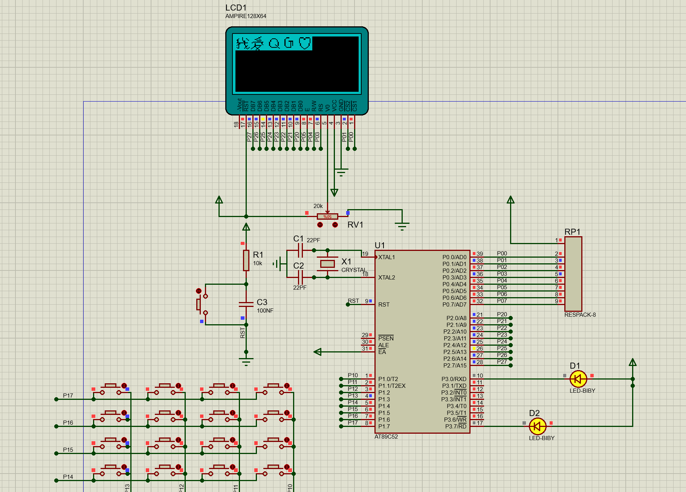
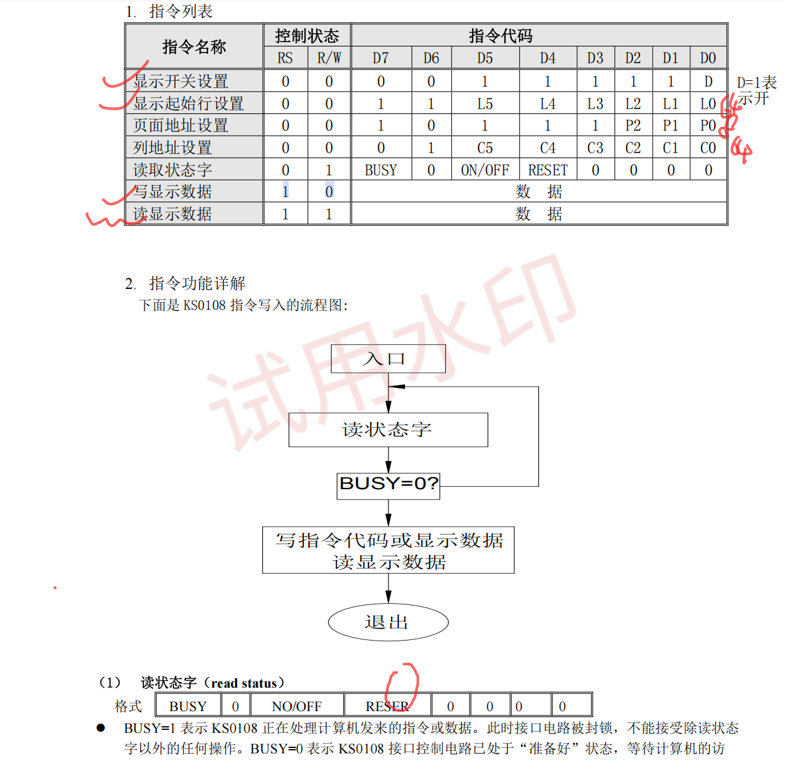
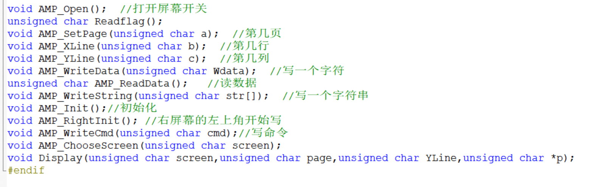

# 作品

想法：将AMPIRE点亮同时在上面显示我爱QG，然后拓展一下按下矩阵按键1的时候再出现爱心顺便把P3.0的小灯点亮+如果屏幕不忙的时候P3.7就亮着

# 实现

连接好线之后开始写代码!
## 步骤
要明白**工作的流程：**通过手册能明白我们想要写命令或者写入其他的就是先要**将RS和RW配置好，将E拉高，立刻将P2配置好写入数据，然后将E拉低为下次做准备，最后别忘记delay一下**让它准备充分防止跑乱了（我一开始是因为把E=1写在了P2配置的前面导致数据是有误，不能输出正确的数据）

1.通过手册会发现任何事情都是**逃不过ReadBusy这一步**的，所以说我们可以把void ReadBusy（）给写好，而且还是要Busy=0才能跑出去
2.之后就开始写其他命令或者数据的代码，但是都不能忘记**第一步**就是把**ReadBusy（）;**加上判断它跑完没有

3.AMPIRE部分完成之后就开始写字的部分，我用的是取模工具，根据手册会发现该读取的方式是**纵向取模而且需要字节倒序**才能成功。
4.后面第一个拓展的话就不说了，是之前matriskey的知识加上if语句
5.拓展2是根据手册发现**显示屏开关flag位是在读取状态字的P2_5位置**，所以就用一个未知数在ReadBusy（）的函数下&0x20就能得到屏幕的状态