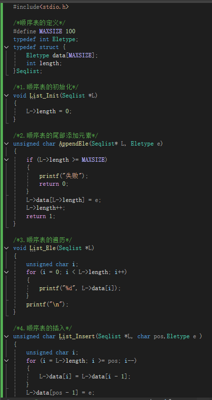
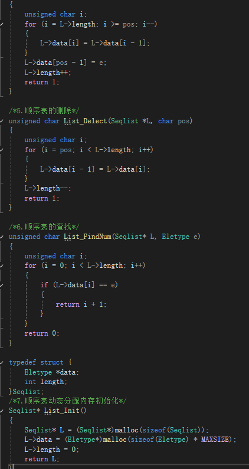
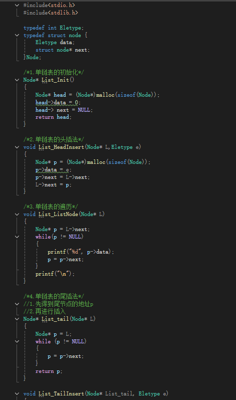
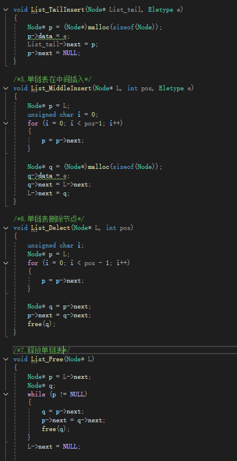
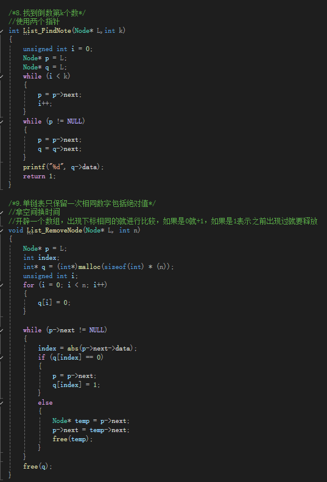
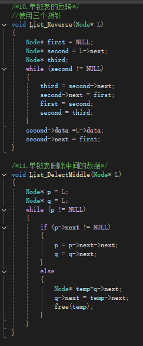
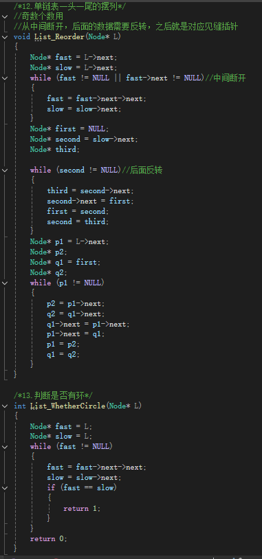
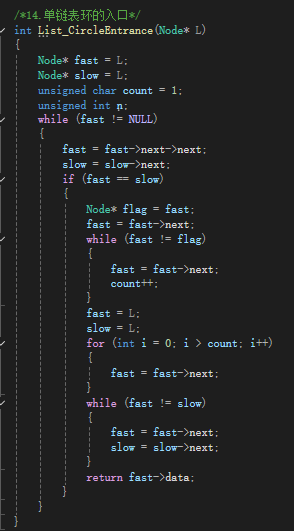
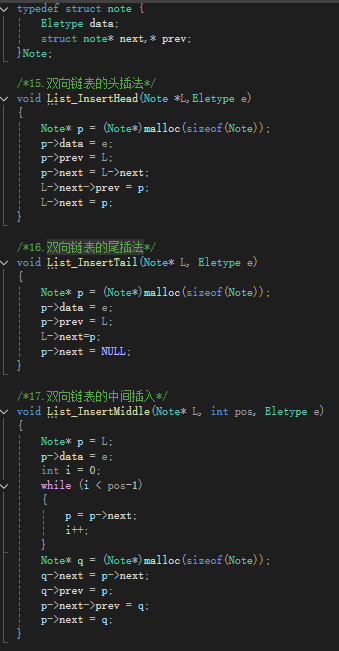
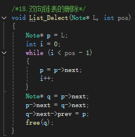

# 时间复杂度与空间复杂度
时间复杂度就是计算运算大致所需要的时间
时间复杂度的计算用大O法，结果取运算次数最高次幂
空间复杂度是临时数据所开辟所需要的空间
空间复杂度的计算也是用大O法，结果就是所占用的最高次幂

---
# 线性表
## 顺序表
1.顺序表的初始化
2.尾部添加元素
3.顺序表的遍历
4.顺序表的插入
5.顺序表的删除
6.顺序表的查找
7.顺序表的动态分配初始化

## 链表
### 单链表
1.链表的初始化
2.链表的头插和尾插
3.单链表的遍历
4.单链表在中间插入
5.单链表删除节点
6.释放单链表
### 循环链表
1.找到倒数第k个数
2.链表只保留一次相同数字包括绝对值
3.链表的反转
4.链表删除中间的数据
5.链表一头一尾的摆列
6.判断是否有环
7.链表环的入口
### 双向链表
1.双向链表的头插
2.双向链表的尾插
3.双向链表的中间插入
4.双向链表的删除

==优劣势==：顺序表的优势是查找数据快，而单链表修改数据快。
==原因==：顺序表查找数据是通过数组下标来找，但是单链表是通过遍历来找；
单链表修改数据快是因为开辟一个堆内存直接内部改造，但是顺序表是通过遍历来修改数据。

