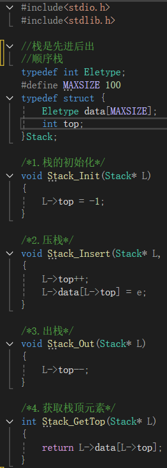
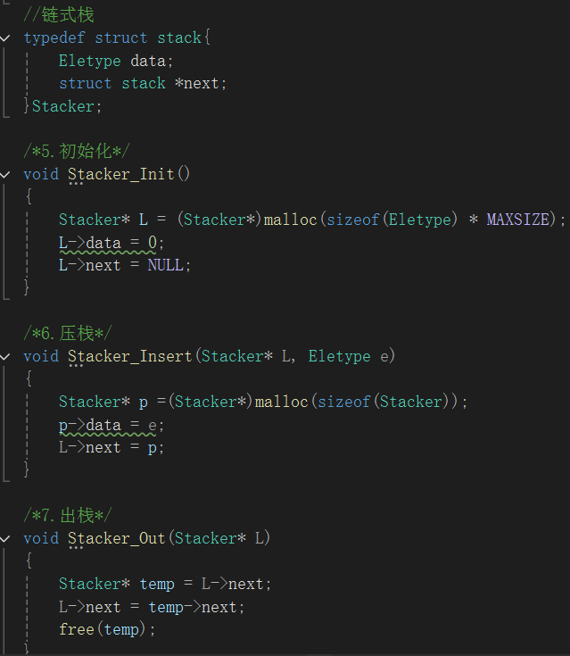
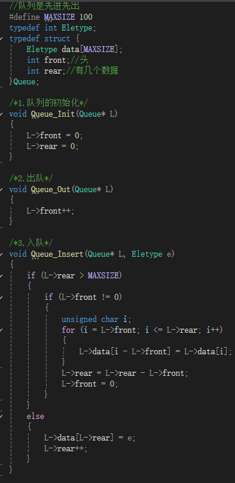
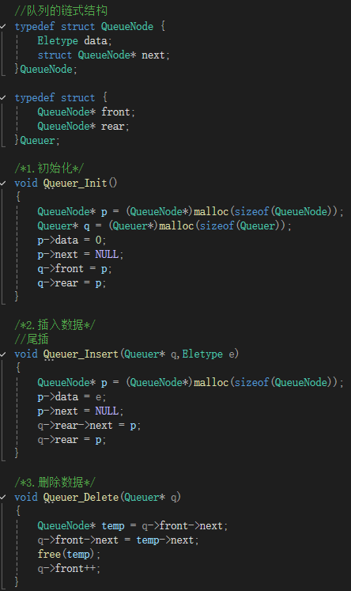

# 栈
栈我觉得更像是特殊的顺序表或者链表
==栈是先进后出==
## 顺序栈
1.栈的初始化
2.压栈
3.出栈

## 链式栈
1.栈的初始化
2.压栈
3.出栈

---

# 队列
队列也是特殊的顺序表或者链表
==队列是先进先出==
## 顺序队列
1.初始化
2.入队
3.出队

### 循环队列
使用循环队列可以有效解决假溢出的形式

## 链式队列
1.初始化
2.插入
3.删除

==总之==栈和队列其实就是顺序表和链表的特殊型，顺序型的遵循顺序表，链式型的遵循链式表。