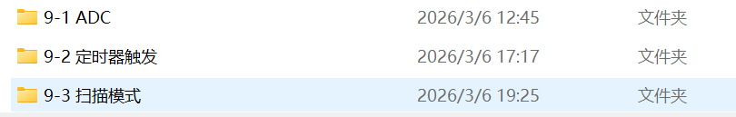
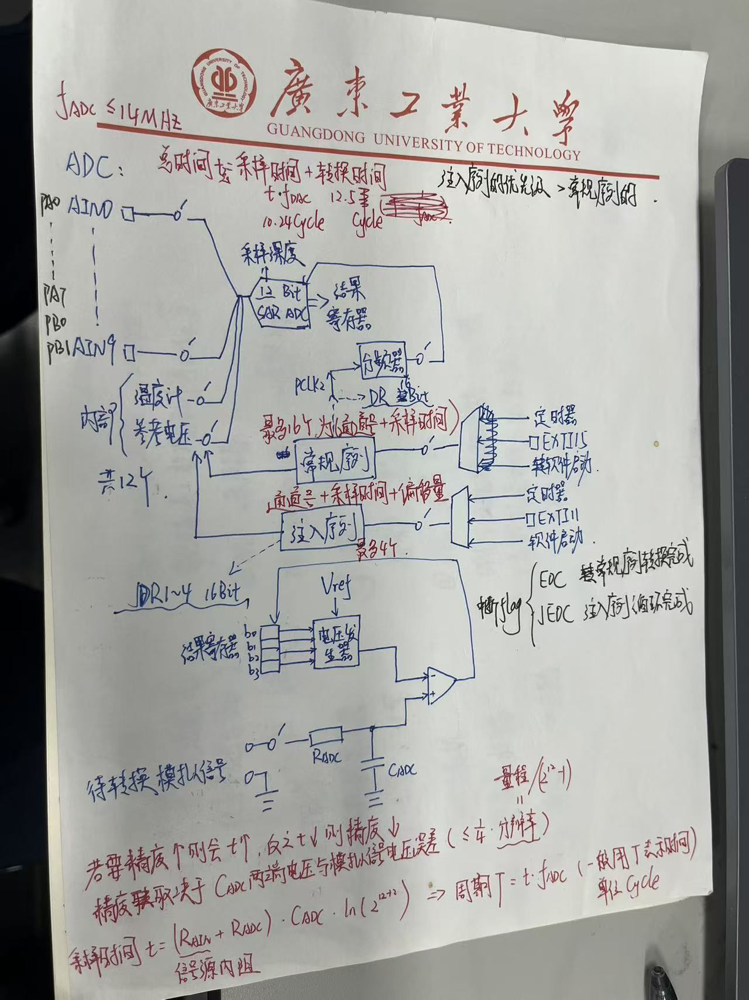

# ADC
**ADC最高的时钟频率是14MHZ**
总体来看是由12个通道（从PA0~PA7,PB0~PB1,还有两个内置的温度计和参考电压）进入“天秤”通过采集模拟信号的电压经过一定的转换事件来储存到结果寄存器之中。
1.关于精度和时间，如果想要精度的上升就需要时间来堆，如果时间减少的代价就是精度的下降。精度取决于Cadc（电容）两端电压与模拟信号电压误差，保证小于1/4*分辨率都能接受
2.ADC的总时间=采样时间+转换时间
3.注入序列的优先级是高于常规序列的优先级的

## 常规序列
常规序列最多可以写16行命令（通道号加上采样时间）
常规序列的来源可以是定时器，EXTI15还有软件启动
传入之前先检查标志位EOC是否执行完毕
常规序列执行之后会将结果传入DR
## 注入序列
注入序列最多只可以写4行命令（通道号加上采样时间加上偏移量）
注入序列的来源可以是定时器，EXTI11还有软件启动
传入之前先检查标志位JEOC是否执行完毕
注入序列执行之后会将结果传入JDRx

