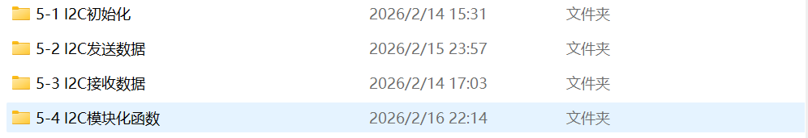

# I2C

I2C模块大致也是需要先配置GPIO模块然后再配置I2C的参数
I2C的标志位：BUSY,SB,AF,ADDR,BTF,TXE,ACK,RXNE

I2C具体过程就是读数据还有写数据：
首先第一步都必须判断引脚是否在忙(BUSY)，然后就发送起始位，发送完之后别忘记判断起始位(SB),接着清除标志位AF,写入从机地址，判断是否寻址成功与应答(ADDR,AF)，由于AF标志位比较特殊，清除标志位ADDR即可**之后两者开始有差别**

==写数据==则是循环写入数据(使用for循环判断(AF,TXE)一个数据一个数据的写入进去寄存器)退出循环之后判断是否完成（BTF）就发送停止位结束
==读数据==则是使能ACK,循环读数据（用for循环判断一次RXNE就读取一次数据）读取完成之后关闭ACK并且发送停止位，最后再来一次判断RXNE并且读取最后一个数据

# SPI
SPI相当于不需要寻址等答复的阶段所以就比I2C简单一点

首先先配置GPIO模块然后再配置SPI的参数
首先就是向发送储存器写入第一个字节，其次循环（等待发送寄存器空(TXE=1),向里面写入第i+1个字节，等待接受寄存器非空(RXNE=1),读取第i个字节），之后便退出循环，等待RXNE最后一次=1，读取最后一个字节，断开开关。