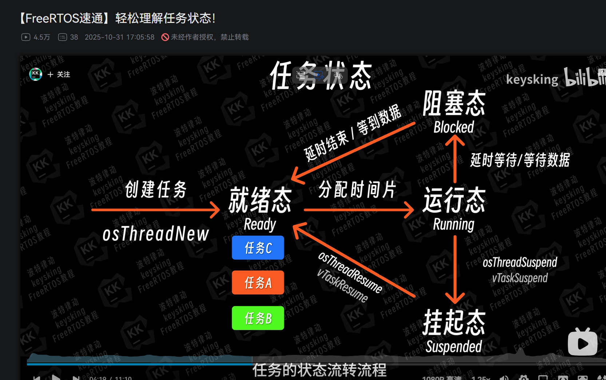

# RTOS
1.RTOS就是**实时操作系统**，最重要的就是在实时这一方面
2.什么时候会用到？基本上就是需要用到延时就需要了，基本上我们用的delay函数其实就是一直查询gettick（）与你想设置的expiretick（）一直轮询进行比较，占用CPU而且会导致程序卡住导致其他的任务进行有拖延。当然确实可以用标志位状态机，但是有更简单的RTOS没有不使用的道理对吧？！
3.RTOS有**四个状态**：就绪态，运行态，阻塞态，挂起态。一开始初始化完毕之后都在就绪态，然后优先级最高的任务就会进入运行态，运行中间如果有delay（或者运行完毕没有下一次循环的就会进入）就会进入阻塞态（挂起态）等待延时结束或者又被触发了什么就回到就绪态，如此进行下去

## 任务TASK
任务好理解，就是你想这个程序所完成的目的并且任务优先级是数字越大优先级越高，和中断不一样
## 队列QUEUE
队列最大的特点就是**先进先出**，当某两个任务出现关联的时候，队列就派上用场了
记得把支持动态内存的宏定义置1
## 二值信息量Binary
记得把支持动态内存的宏定义置1
二值信息量其实就是**长度为1的队列**，用来==同步==
二值信息量容易导致**优先级翻转**（优先级高的却无法抢占优先级低的）
过程：==创建->释放->获取==
二值信息量用于**任务同步，中断**
### 互斥信号量Mutex
记得把支持动态内存的宏定义置1而且还需要将允许使用互斥信号量的宏定义置1
互斥信息量其实就是**长度为1的队列**，用来==互斥==
互斥信息量有**优先级继承**（当优先级高的无法抢占优先级低的的时候，将优先级低的抢占优先级提升到和那个高的一样）
过程：==创建->获取->释放==
互斥信息量一般用于**保护共享资源**上，而且==互斥信息量是无法进行中断的==
### 计数型信号量Counting
记得把支持动态内存的宏定义置1而且还需要将允许使用计数型信号量的宏定义置1
计数型信号量其实就是**长度大于1的队列**
计数型信号量有两个作用：1.事件计数2.多资源管理
#### 事件计数
事件计数过程：创建->释放->获取
#### 多资源管理
多资源管理过程：创建->获取->释放

## 事件标志组
事件标志组具有多任务同步的机制
事件任务组较于二值信号量优点在于他可以是多个事件组合来同时进行

## 软件定时器
软件定时器其实就是定时器，将用到的定时器初始化好后就可以开始调用了，注意该定时器的最小精度是1ms，这点需要注意
