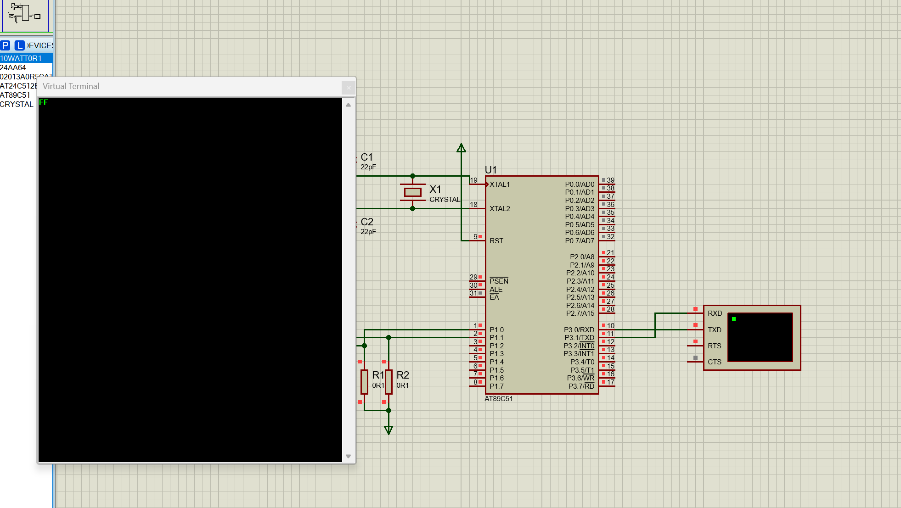
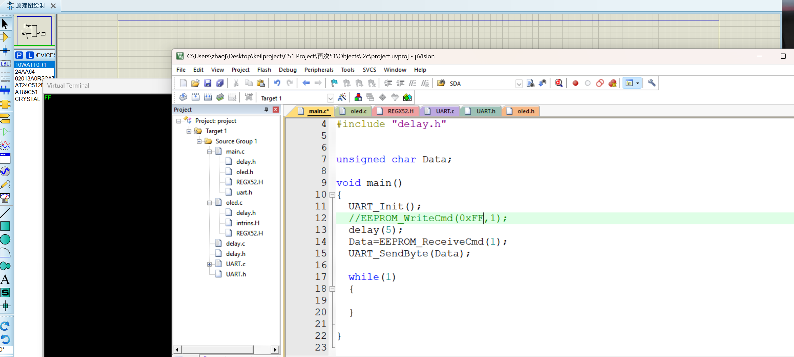
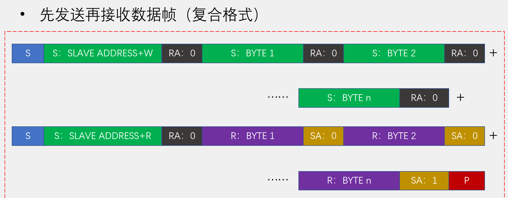
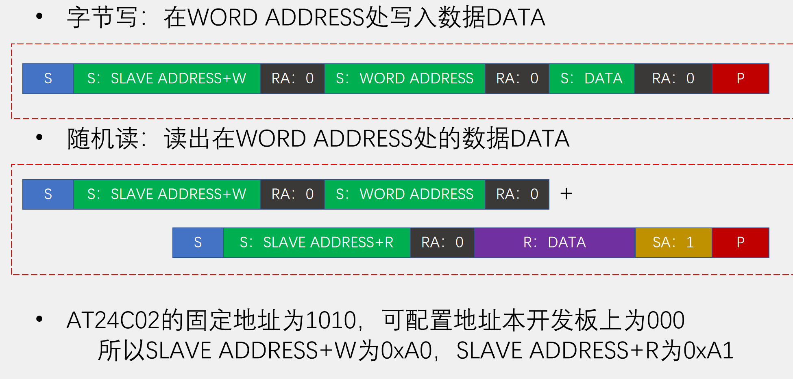

# EEPROM

EEPROM属于非易失性储存芯片，在断电之后能保存数据。而图片中的EEPROM使用I2C的通讯方式来实现。A1,A2,A3均接地从而知道它的地址是0xA0,根据I2C的通讯方式来写出起始位，停止位，再写出发送数据还有接收数据封装函数。接着就是EEPROM特有的了：按照图片封装好发送函数还有接收函数(它的接收函数和I2C是有点不相同的，前面不太一样)即可。最后用上之前学的UART把EEPROM里面断电但是保存的数据输出到电脑显示就可以了。

关于为什么会是输出FF原因我还在找，其他数据居然也是输出FF，我也试着拿江科大的代码直接来弄结果也是输出FF，原因也还在找。